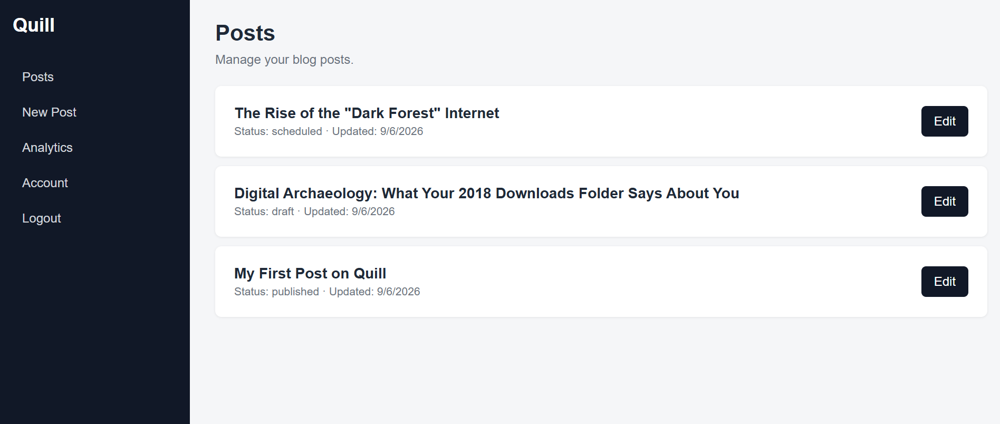
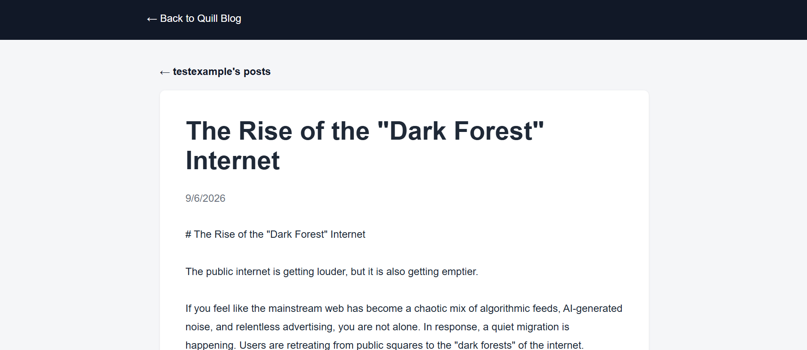

# Quill — An MCP-Native Blogging Platform

> "Talk to your blog the way you talk to your code."


Quill is an agent-first, MCP-native blogging platform built as a fellowship capstone project for **Zeppelin Labs**. Instead of managing a blog through a traditional CMS dashboard, users get a personal MCP server endpoint that connects directly to their IDE or coding agent (Claude Code, Cursor, etc.), allowing full blog management — drafting, editing, publishing, analytics — through natural-language requests.

A companion server-rendered web dashboard and a minimal public read-only blog share the same backend and database, so the two surfaces never drift apart.

---

## Table of Contents

* [Overview](#overview)
* [Architecture](#architecture)
* [Tech Stack](#tech-stack)
* [Data Model](#data-model)
* [MCP Tool Surface](#mcp-tool-surface)
* [Project Structure](#project-structure)
* [Getting Started](#getting-started)
* [Environment Variables](#environment-variables)
* [Available Scripts](#available-scripts)
* [Authentication Model](#authentication-model)
* [Deployment](#deployment)
* [Team & Contributions](#team--contributions)
* [Known Limitations](#known-limitations)

---

## Overview

Quill lets a developer or technical writer go from "idea" to "published post" without leaving their IDE. Blog management is exposed as a small, well-designed set of MCP tools rather than a traditional UI, while a server-rendered dashboard and public blog provide a second, always-available front door backed by the exact same application logic.

**Core capabilities:**

* Personal MCP server URL, authenticated via API key, exposing full post lifecycle management
* Server-rendered web dashboard for account, post, and analytics management
* Public, multi-tenant, read-only blog (`/blog/:username/:slug`)
* SQLite-backed persistence with versioned migrations
* Single Node.js process serving the MCP endpoint, dashboard, and public blog together
* Containerized, production-ready deployment

---

## Product Preview

### Dashboard



Quill's server-rendered dashboard provides a unified interface for managing posts, publishing status, and analytics.

### Published Post



Published posts are available through Quill's public, read-only blog, backed by the same application logic and database as the dashboard and MCP server.

---

## Architecture

Quill follows a strict shared-backend architecture: the MCP server, the web dashboard, and the public blog are three different *entry points* into the same core application logic — none of them contain their own duplicated business logic.

```text
IDE / MCP Client             Dashboard (Browser)

       │                            │
       ▼                            ▼
 MCP Server  ─────────────►  Hono Web Routes
       │                            │
       └────────────┬───────────────┘
                    ▼
           Core Services Layer
        (auth, posts, analytics,
              API keys)
                    │
                    ▼
          Repository / Data Access
                    │
                    ▼
              SQLite Database
```

**Dependency direction is one-way:** `Database → Repositories → Services → (MCP tools | Web routes)`. Repositories are the only layer permitted to write SQL; services own all business rules (slug generation, publish/schedule logic, ownership enforcement); MCP tools and web routes are thin adapters that never duplicate logic between them.

---

## Tech Stack

| Layer             | Technology                                             |
| ----------------- | ------------------------------------------------------ |
| Language          | TypeScript (NodeNext modules)                          |
| Web framework     | [Hono](https://hono.dev/)                              |
| MCP               | `@modelcontextprotocol/sdk`, Streamable HTTP transport |
| Database          | SQLite via Node's built-in `node:sqlite`               |
| Validation        | Zod                                                    |
| Server            | `@hono/node-server`                                    |
| Runtime           | Node.js 24+                                            |
| Containerization  | Docker (`node:24-alpine`)                              |
| Deployment target | Render (Docker runtime + persistent disk)              |

No ORM is used — the repository layer writes parameterized SQL directly against `node:sqlite`, keeping the dependency footprint minimal per the project's design constraints.

---

## Data Model

Four core tables, defined in `src/database/migrations/`:

```text
users(id, email, username, password_hash, created_at)

api_keys(id, user_id, key_hash, created_at, revoked_at)

posts(id, user_id, title, slug, content_md, status,
      meta_title, meta_description, published_at, scheduled_at,
      created_at, updated_at)

analytics_events(id, post_id, event_type, referrer, occurred_at)
```

**Key design decisions:**

* IDs are randomly generated UUIDs (`TEXT`), not sequential integers, to avoid enumeration and information leakage through IDs used in public URLs.
* Timestamps are stored as ISO 8601 strings for unambiguous cross-timezone sorting and parsing.
* `posts.status` is constrained at the database level via `CHECK (status IN ('draft', 'scheduled', 'published'))`.
* `posts` has a composite `UNIQUE(user_id, slug)` constraint — slugs are unique per author, not globally, enabling clean multi-tenant public URLs.
* `analytics_events` intentionally has no `user_id` column; ownership is always derived through a `JOIN` on `posts.user_id`, enforced at the repository layer so it can never be bypassed by a service.
* Foreign keys use `ON DELETE CASCADE` throughout, enforced via `PRAGMA foreign_keys = ON` on every connection.

Schema changes are applied through versioned, idempotent migration files (`001_initial.sql`, `002_add_username.sql`, ...), tracked in a `_migrations` table and run automatically on server boot.

---

## MCP Tool Surface

Every tool call is authenticated via API key and scoped to the resolved user — no tool ever accepts a raw `user_id` argument.

| Tool             | Description                                        |
| ---------------- | -------------------------------------------------- |
| `create_post`    | Create a new draft post                            |
| `update_post`    | Edit an existing post's title/content              |
| `delete_post`    | Delete a post                                      |
| `list_posts`     | List posts, optionally filtered by status          |
| `get_post`       | Fetch full details of one post                     |
| `publish_post`   | Publish a draft immediately                        |
| `schedule_post`  | Schedule a post for future publication             |
| `unpublish_post` | Revert a published post to draft                   |
| `manage_seo`     | Set meta title, description, and slug              |
| `get_analytics`  | Retrieve views, referrers, and top-post breakdowns |

The MCP endpoint is served at `POST /mcp` using the Streamable HTTP transport, authenticated via `Authorization: Bearer <api_key>`.

---

## Project Structure

```text
src/

├── core/
│   ├── types/          # Domain types + Zod validation schemas
│   ├── repositories/   # All SQL lives here — the only DB access layer
│   └── services/       # Business logic: auth, posts, API keys, analytics
├── database/
│   ├── connection.ts   # Single shared SQLite connection
│   ├── migrate.ts      # Migration runner
│   └── migrations/     # Versioned .sql migration files
├── mcp/                # MCP server, tools, transport, and backend adapter
├── auth/               # Signup/login pages and routes
├── web/
│   ├── dashboard/      # Server-rendered dashboard (posts, analytics, account)
│   ├── public-blog/    # Multi-tenant public read-only blog
│   ├── routes/         # REST API routes (/api/*)
│   └── middleware/     # Session (cookie) and API-key auth middleware
└── index.ts            # Application entry point — mounts everything

deployment/

├── Dockerfile
├── .dockerignore
└── render.yaml
```

---

## Getting Started

### Prerequisites

* Node.js **24+** (required for the built-in `node:sqlite` module)
* npm

### Installation

```bash
git clone https://github.com/suraiba-idrees/quill-mcp-blogging-platform.git

cd quill-mcp-blogging-platform

npm install

cp .env.example .env
```

### Run in development

```bash
npm run dev
```

The server starts on `http://localhost:3000`, running database migrations automatically on boot.

* Dashboard: `http://localhost:3000/dashboard`
* Public blog: `http://localhost:3000/blog`
* Health check: `http://localhost:3000/health`
* MCP endpoint: `http://localhost:3000/mcp`

### Run migrations manually

```bash
npm run db:migrate
```

Safe to run repeatedly — already-applied migrations are skipped automatically.

---

## Environment Variables

See `.env.example` for the full list.

| Variable         | Description                               | Default                 |
| ---------------- | ----------------------------------------- | ----------------------- |
| `NODE_ENV`       | `development` or `production`             | `development`           |
| `PORT`           | Port the server listens on                | `3000`                  |
| `DATABASE_PATH`  | Path to the SQLite database file          | `./data/quill.db`       |
| `BASE_URL`       | Public base URL of the deployment         | `http://localhost:3000` |
| `SESSION_SECRET` | Secret used for dashboard session cookies | *(must be set)*         |
| `CORS_ORIGIN`    | Allowed origin for `/api/*` CORS requests | `http://localhost:5173` |

---

## Available Scripts

| Command              | Description                             |
| -------------------- | --------------------------------------- |
| `npm run dev`        | Start the dev server with file watching |
| `npm run build`      | Compile TypeScript to `dist/`           |
| `npm start`          | Run the compiled production build       |
| `npm run typecheck`  | Type-check without emitting files       |
| `npm run db:migrate` | Apply pending database migrations       |
| `npm test`           | Run the test suite                      |

---

## Authentication Model

Quill uses two independent credentials by design, each scoped to a different surface:

* **`password_hash`** — authenticates a human into the dashboard via a session cookie. Hashed with `scrypt` and a random per-user salt; verified using a constant-time comparison to resist timing attacks.

* **API keys** — authenticate an agent (or the dashboard's own session, which is issued an API key at login) into the MCP endpoint and REST API. Keys are generated with 256 bits of cryptographic randomness, hashed with SHA-256 before storage, and shown to the user in plaintext exactly once, at generation time.

A leaked MCP API key exposes only agent-level access — never the dashboard password — preserving the separation the PRD required.

Every database query that touches user-owned data (posts, API keys, analytics) is scoped by `user_id` at the repository layer, ensuring cross-user data access is structurally impossible rather than merely checked at the application layer.

---

## Deployment

Quill is designed to run as a single containerized process with persistent SQLite storage — not on serverless platforms (e.g. Vercel), since serverless environments do not guarantee persistent disk storage between invocations, which SQLite requires.

**Deployment target:** [Render](https://render.com/) (Docker runtime)

```bash
# Build and run locally to verify the production image
docker build -f deployment/Dockerfile -t quill .

docker run -p 3000:3000 \
  -e DATABASE_PATH=/data/quill.db \
  -v $(pwd)/data:/data \
  quill
```

`render.yaml` defines the full service configuration, including a persistent disk mounted at `/data` so the SQLite database survives redeploys and restarts.

---

## Team & Contributions

Built by a four-person team for the Zeppelin Labs AI & Generative AI Fellowship:

| Area                              | Owner                                                 | Scope                                                                                   |
| --------------------------------- | ----------------------------------------------------- | --------------------------------------------------------------------------------------- |
| Core & Database Foundation        | [Suraiba Idrees](https://github.com/suraiba-idrees)   | Schema, migrations, repositories, services, auth, full frontend↔backend↔MCP integration |
| MCP Server & Tools                | [Maryam Imran Shah](https://github.com/syedamaryam15) | MCP server, Streamable HTTP transport, tool definitions                                 |
| Web Dashboard & Public Blog       | [Aniqa Qamar](https://github.com/aniqaqamar6-bit)     | Dashboard UI, public blog pages, auth page templates                                    |
| Deployment & Production Readiness | [Saboora Khalil](https://github.com/saboorawdpdata)   | Dockerfile, container configuration, Render deployment setup                            |

---

## Known Limitations

In the interest of transparency, the following are known, deliberate scope trade-offs rather than oversights:

* **Markdown rendering:** Post content is currently displayed as plain pre-formatted text on the public blog rather than rendered HTML (no Markdown-to-HTML conversion yet).

* **Tags:** The MCP tool schema includes a `tags` field for forward compatibility with the original PRD tool spec, but tags are not yet part of the persisted data model.

* **Real-agent MCP testing:** The MCP server was verified via direct HTTP/JSON-RPC protocol testing (simulating an MCP client's handshake), confirming authentication, session negotiation, and protocol compliance. Full third-party agent testing (Claude Code, Cursor) was constrained by subscription/API billing requirements outside the project's scope.

* **Rate limiting:** Per-key rate limiting on MCP write tools, mentioned in the PRD's non-functional requirements, is not yet implemented.

## Contributing & Contact

This project was built as a fellowship capstone and isn't actively seeking external contributions, but feedback and questions are welcome.

* Found a bug or have a suggestion? Please [open an issue](https://github.com/suraiba-idrees/quill-mcp-blogging-platform/issues) describing what you found and how to reproduce it.

* For anything else, feel free to reach out to any of the contributors listed above via their GitHub profiles.

---

<p align="center">Built with care for the Zeppelin Labs AI & Generative AI Fellowship.</p>
